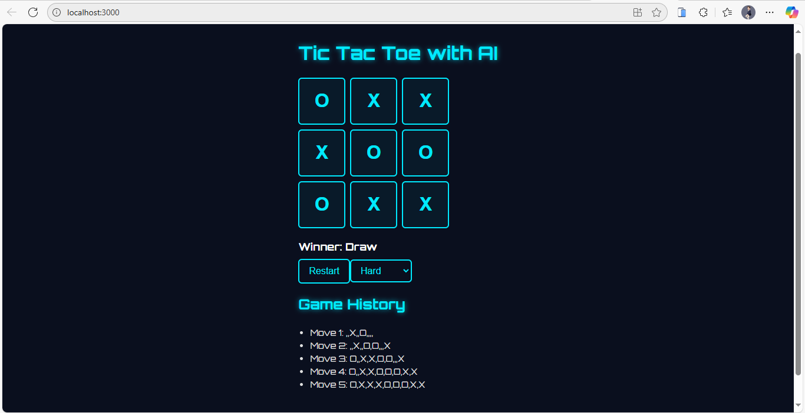

# 🎮 Tic Tac Toe with AI

[](https://github.com/usamahdhaqi/tic-tac-toe-ai/stargazers)
[](https://github.com/usamahdhaqi/tic-tac-toe-ai/issues)
[](https://github.com/usamahdhaqi/tic-tac-toe-ai/blob/main/LICENSE)

A modern **Tic Tac Toe Game** built with **React.js**, featuring an **AI opponent powered by the Minimax algorithm**.  
Designed with a **sci-fi, minimalistic, and modern theme**.

---

## ✨ Features

- 🤖 **AI Opponent** using Minimax algorithm  
- 🎚️ **Difficulty Levels**: Easy (random), Medium (mix), Hard (unbeatable)  
- 📜 **Game History Tracking** (review past moves)  
- 🔄 **Restart Game** anytime  
- 🎨 **Custom Sci-Fi UI** with glowing effects and futuristic typography  

---

## 🛠️ Tech Stack

- [React.js](https://react.dev/) – Frontend library  
- **Vanilla CSS** – For sci-fi minimalistic design  
- **Minimax Algorithm** – AI decision-making  

---

## 📂 Project Structure

```
tic-tac-toe-ai/
├── src/
│   ├── App.js        # Main game logic
│   ├── App.css       # Sci-fi UI styles
│   ├── Board.js      # Game board component
│   ├── Square.js     # Each square component
│   ├── AI.js         # Minimax algorithm & difficulty
│   └── index.js      # React entry point
└── public/
    └── index.html    # Includes Orbitron sci-fi font
```

---

## 🚀 Getting Started

### 1. Clone Repository
```bash
git clone https://github.com/usamahdhaqi/tic-tac-toe-ai.git
cd tic-tac-toe-ai
```

### 2. Install Dependencies
```bash
npm install
```

### 3. Run Application
```bash
npm start
```

App will be available at 👉 [http://localhost:3000](http://localhost:3000)

---

## 🖥️ Gameplay Preview

- Player always plays as **X**  
- AI plays as **O**  
- Choose difficulty level from dropdown  
- Game ends when **Winner** or **Draw** is detected  

---

## 📸 Screenshots

 

---

## 🧠 AI Algorithm

This game uses the **Minimax algorithm** for the AI:
- **Easy** → Random moves  
- **Medium** → 50% chance minimax, 50% random  
- **Hard** → Full minimax (unbeatable AI)  

---

## 🤝 Contributing

Feel free to **fork this repo** and submit pull requests if you’d like to improve the game (e.g., animations, multiplayer mode, leaderboard).

---

## 📜 License

This project is licensed under the **MIT License**.

---

## ⭐ Show Your Support

If you like this project, please **star this repo** ⭐ on GitHub!
